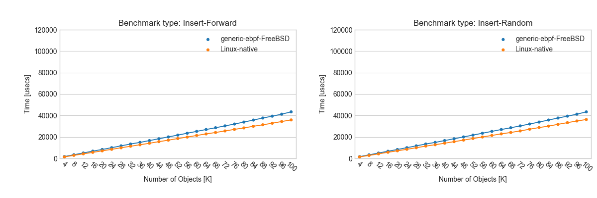
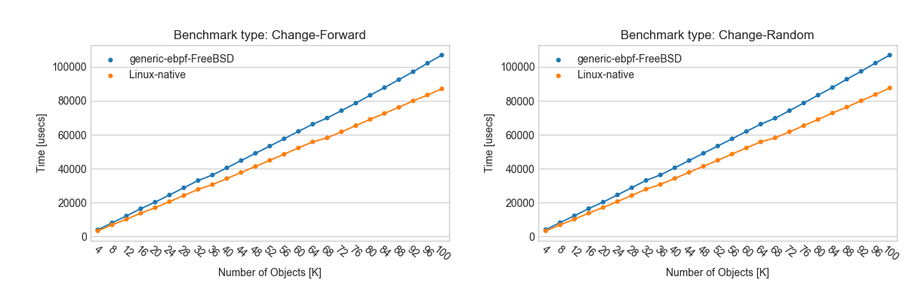
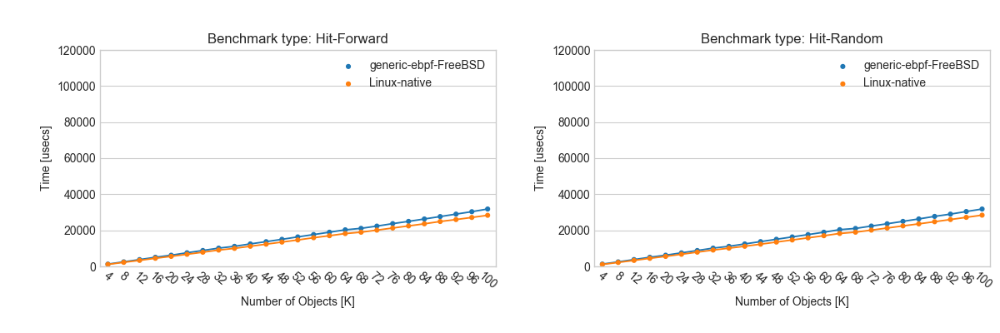
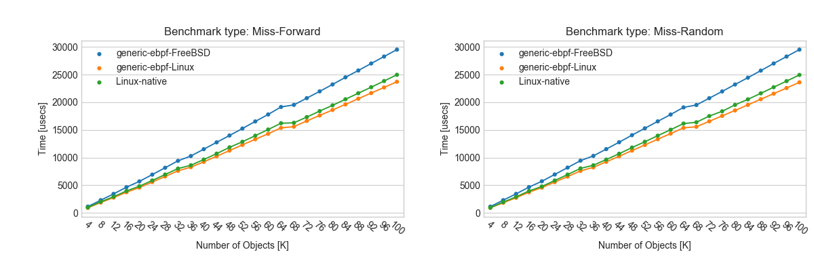
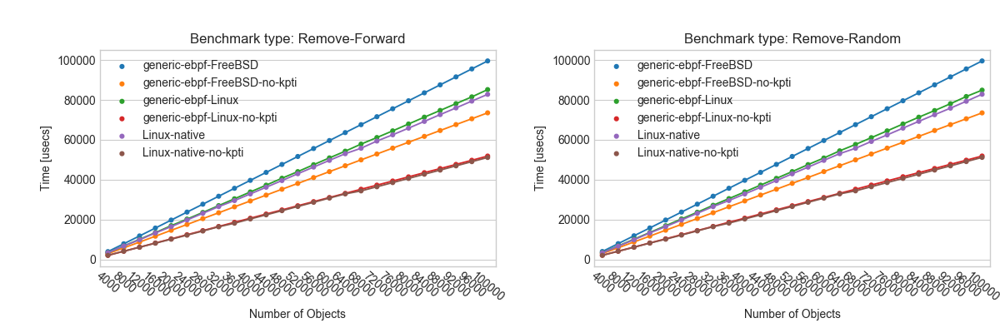

# Generic eBPF benchmarks

We did some micro benchmarks to measure the performance
of generic-ebpf. Below shows their setup and results.

## Map performance benchmark

Here we have performance number of maps. Benchmark procedure is based on [tommyds's
one](http://www.tommyds.it/doc/benchmark). Please see our code at benchmark/map\_benchmark.c
for more details.

We compared Linux's native map and generic-ebpf map on FreeBSD for each cases.

### Setup

- CPU: Intel(R) Core(TM) i7-6850K CPU @ 3.60GHz (3599.03-MHz K8-class CPU)
- Memory: 4GB
- OS: Linux-4.16.10 and FreeBSD-11.1-RELEASE
- Turn off Hyper-Threading and Turbo-Boost
- Set C-State to C0
- Run benchmark on single CPU (set affinity by taskset or cpuset)

### Results

#### Hashtable Map

Below shows benchmark results for hashtable map. Lower is better.

##### Insert

##### Change

##### Hit

##### Miss

##### Remove

